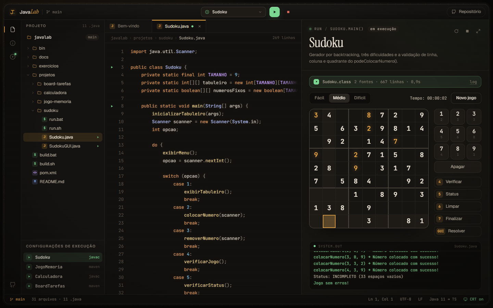
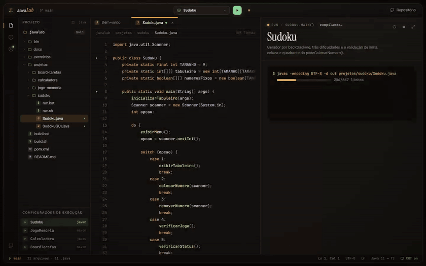

# JavaLab

Quatro aplicações em Java puro abertas numa IDE que roda no navegador: o código-fonte real ao lado de um porte fiel que você executa ali mesmo.

**[Ver ao vivo →](https://leandromlmoreira.github.io/javalab/)**

[](https://leandromlmoreira.github.io/javalab/)

<p align="center">
  
</p>

## O que tem aqui

| App | O que faz | Onde |
|---|---|---|
| **Sudoku** | Tabuleiro 9x9 com gerador, três dificuldades (30/40/50 casas removidas), validação de linha, coluna e quadrante, verificação de status e cronômetro. Versão texto e versão Swing. | `projetos/sudoku/` |
| **Jogo da Memória** | Coleções de cartas (mínimo 10), lances, acertos, percentual e pausa, com estado salvo em JSON e YAML via Jackson. | `projetos/jogo-memoria/` |
| **Calculadora** | Menu em loop com `Scanner`: soma, subtração, multiplicação, divisão com resto, potência e submenu que acumula resultados. | `projetos/calculadora/` |
| **Board de Tarefas** | Kanban com colunas padrão, bloqueio/desbloqueio com motivo e relatórios de tempo e bloqueios, persistido em MySQL via JDBC. | `projetos/board-tarefas/` |
| **Exercícios 1 a 6** | Tipos, controle de fluxo, POO, herança, interfaces, collections e streams. | `exercicios/` |

## A IDE no navegador

Java não roda no navegador, então a pasta `web/` monta uma IDE retrô que mostra o repositório de verdade e executa um porte de cada `main()`:

- **Explorador com a árvore real do repositório**: a lista de arquivos e o conteúdo exibido vêm dos próprios `.java`, `pom.xml`, scripts e notas em `docs/`, importados no build (`import.meta.glob` com `?raw`). Nada é copiado à mão.
- **Abas, breadcrumb e destaque de sintaxe** com um tokenizador próprio e pequeno para Java, Markdown, XML e shell.
- **Painel Run**: cada app passa por uma animação de `javac`/`mvn compile` com a contagem real de linhas e então roda:
  - **Sudoku**: gerador por backtracking usando o mesmo `podeColocarNumero()`, dificuldades do `SudokuGUI`, opções do menu de `Sudoku.java` (verificar, status, limpar, finalizar) com as mesmas mensagens, teclado e cronômetro.
  - **Jogo da Memória**: `Carta`, `Colecao` e `Jogo` portados, espera de 2 s no erro como o `Thread.sleep(2000)`, pausa, status, criação de coleções e placar salvo no navegador no lugar do `jogo_memoria.json`.
  - **Calculadora**: o programa inteiro roda num terminal com um `Scanner` assíncrono, formatação de `double` igual à do Java e até o `InputMismatchException` quando a entrada é inválida.
  - **Board de Tarefas**: simulação em memória com as mesmas regras (card bloqueado não anda, coluna final, cancelamento) e o SQL que o `PreparedStatement` executaria aparecendo no log.
- **Efeito CRT** sutil (scanlines e brilho leve) que pode ser desligado na barra de status.
- **Mobile**: explorador vira gaveta, e Código e Run alternam em tela cheia.

## Stack

- **Java 11+**, Maven (módulos `jogo-memoria` e `board-tarefas`), Jackson (JSON/YAML), MySQL Connector/J, Swing
- **Web**: Vite + TypeScript sem framework, CSS próprio, fontes Instrument Serif, Geist e JetBrains Mono
- **Deploy**: GitHub Actions publicando `web/dist` no GitHub Pages

## Como rodar

### Os apps Java

```bash
./build.sh      # Linux/macOS: compila exercícios e projetos
build.bat       # Windows
```

```bash
cd projetos/sudoku && javac Sudoku.java SudokuGUI.java && java SudokuGUI
cd projetos/calculadora && javac Calculadora.java && java Calculadora
cd projetos/jogo-memoria && mvn -q compile exec:java -Dexec.mainClass="JogoMemoria"
cd projetos/board-tarefas && mvn -q compile exec:java -Dexec.mainClass="BoardTarefas"
```

A versão texto do Sudoku aceita números fixos por argumento (`numero linha coluna`), e `bin/run.sh` / `bin\run.bat` compilam e executam direto. O Board de Tarefas precisa de um MySQL 8.0+ (URL e usuário em `BoardTarefas.java`); as tabelas são criadas na primeira execução.

Pré-requisitos: JDK 11+; Maven 3.6+ e MySQL 8.0+ só para os módulos que dependem deles.

### A IDE web

```bash
cd web
npm install
npm run dev      # desenvolvimento
npm run build    # gera web/dist
```

O deploy roda sozinho a cada push na `main` que mexa em `web/`, nos fontes Java ou em `docs/`.

## Documentação

Notas de estudo por módulo em `docs/exercicios/` e `docs/projetos/`, também navegáveis pela IDE.

## Licença

Uso livre para fins educacionais e de referência.

---

<sub>Base: estudos da trilha Java da DIO.</sub>
